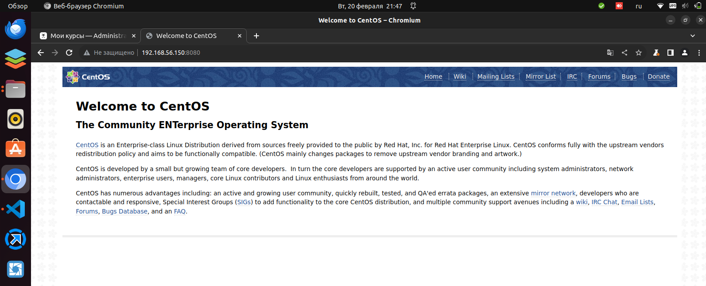

# Домашнее задание: Первые шаги с Ansible

## Решение:

Задание выполнено на машине vagrant с помощью Ansible.

Я выполнил задание на основе методички, но исполнил в виде роли. 

Скрипт `deploy.sh`:
 - создаёт виртуальную машину с помощью Vagrantfile;
 - заускает единственную роль `nginx`

Результат можно видеть на скриншоте, где браузером обрааемся к nginx в виртушке vagrant:




<details>
<summary>Вывод лога работы скрипта</summary>

```bash
user@intel:~/Nextcloud/Документы/OTUS/OTUS-Task11$ ./deploy.sh 
Создаём виртуальную машину vagrant
Bringing machine 'nginx' up with 'virtualbox' provider...
==> nginx: Importing base box 'centos/7'...
==> nginx: Matching MAC address for NAT networking...
==> nginx: Setting the name of the VM: vagrant_nginx_1708455119127_57541
==> nginx: Clearing any previously set network interfaces...
==> nginx: Preparing network interfaces based on configuration...
    nginx: Adapter 1: nat
    nginx: Adapter 2: hostonly
==> nginx: Forwarding ports...
    nginx: 22 (guest) => 2222 (host) (adapter 1)
==> nginx: Running 'pre-boot' VM customizations...
==> nginx: Booting VM...
==> nginx: Waiting for machine to boot. This may take a few minutes...
    nginx: SSH address: 127.0.0.1:2222
    nginx: SSH username: vagrant
    nginx: SSH auth method: private key
    nginx: 
    nginx: Vagrant insecure key detected. Vagrant will automatically replace
    nginx: this with a newly generated keypair for better security.
    nginx: 
    nginx: Inserting generated public key within guest...
    nginx: Removing insecure key from the guest if it's present...
    nginx: Key inserted! Disconnecting and reconnecting using new SSH key...
==> nginx: Machine booted and ready!
==> nginx: Checking for guest additions in VM...
    nginx: No guest additions were detected on the base box for this VM! Guest
    nginx: additions are required for forwarded ports, shared folders, host only
    nginx: networking, and more. If SSH fails on this machine, please install
    nginx: the guest additions and repackage the box to continue.
    nginx: 
    nginx: This is not an error message; everything may continue to work properly,
    nginx: in which case you may ignore this message.
==> nginx: Setting hostname...
==> nginx: Configuring and enabling network interfaces...
==> nginx: Rsyncing folder: /home/user/Nextcloud/Документы/OTUS/OTUS-Task11/vagrant/ => /vagrant
==> nginx: Running provisioner: shell...
    nginx: Running: inline script
==> nginx: Snapshotting the machine as 'push_1708455213_3776'...
==> nginx: Snapshot saved! You can restore the snapshot at any time by
==> nginx: using `vagrant snapshot restore`. You can delete it using
==> nginx: `vagrant snapshot delete`.
Выполняем действия над vagrant машиной

PLAY [all] ***************************************************************************************************************************************

TASK [Gathering Facts] ***************************************************************************************************************************
ok: [nginx]

TASK [nginx : NGINX | Install and configure NGINX] ***********************************************************************************************
changed: [nginx]

TASK [nginx : NGINX | Install NGINX package from EPEL Repo] **************************************************************************************
changed: [nginx]

TASK [nginx : NGINX | Create NGINX config file from template] ************************************************************************************
changed: [nginx]

RUNNING HANDLER [nginx : restart nginx] **********************************************************************************************************
changed: [nginx]

RUNNING HANDLER [nginx : reload nginx] ***********************************************************************************************************
changed: [nginx]

PLAY RECAP ***************************************************************************************************************************************
nginx                      : ok=6    changed=5    unreachable=0    failed=0    skipped=0    rescued=0    ignored=0   

user@intel:~/Nextcloud/Документы/OTUS/OTUS-Task11$ 

```
</details>